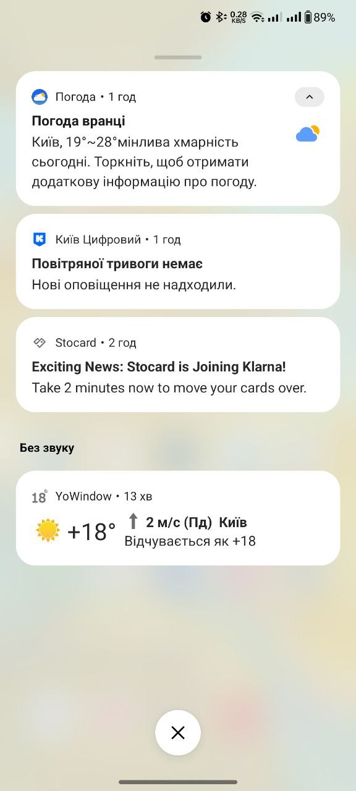
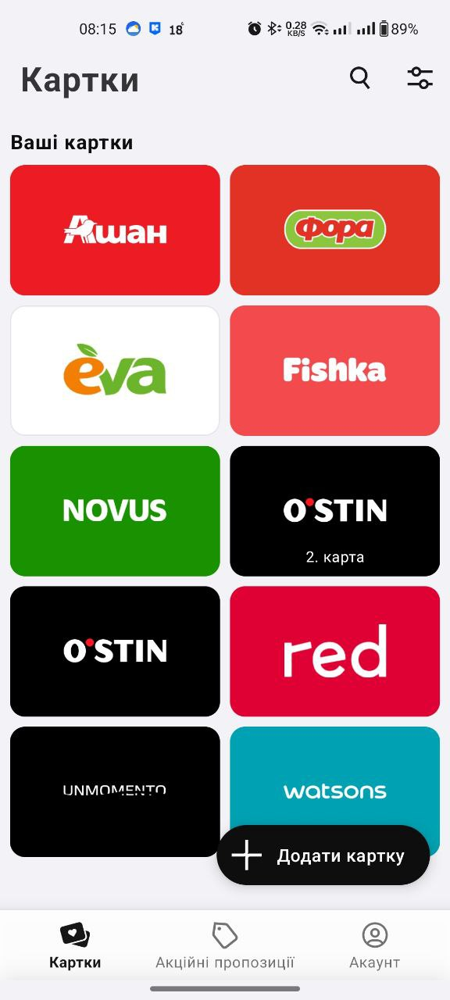

# BUG-001: Klarna Transfer Notification Does Not Open Relevant Screen

## Bug Summary
Push notification "Exciting News: Stocard is Joining Klarna! Take 2 minutes now to move your cards over" opens to default home screen instead of Klarna transfer functionality.

## Priority
**High** - Affects key user journey for business-critical integration

## Severity
**High** - Major UX issue impacting user conversion

## Bug Type
- [ ] Functional
- [x] UI/UX
- [ ] Performance
- [ ] Security
- [ ] Compatibility

## Environment
- **Device:** OnePlus 8T
- **OS:** Android 14
- **App Version:** 10.67.0 #1210
- **Date Found:** 05.06.2025

## Steps to Reproduce
1. Receive push notification: "Exciting News: Stocard is Joining Klarna! Take 2 minutes now to move your cards over"
2. Tap on the notification

## Expected Behavior
App should open to a screen with:
- Clear explanation of what Klarna is
- Instructions for transferring cards
- Benefits of the transfer
- Clear call-to-action buttons

## Actual Behavior
- App opens to default home screen
- No Klarna-related information visible
- No guidance or next steps provided
- User is left confused about how to proceed

## Screenshots

*Push notification received*

*App opens to home screen with no Klarna information*

## Impact Assessment
- **User Experience:** Users cannot complete the advertised action
- **Business Impact:** Likely reduces Klarna integration adoption rates
- **User Confusion:** Notification promises functionality that isn't accessible

## Root Cause Analysis
**Primary Issue:** Missing deep link configuration or incomplete feature implementation

**Secondary Issue:** Poor user communication - notification assumes knowledge of Klarna without explanation

## Recommended Fix
**Immediate Actions:**
1. Implement deep link from notification to Klarna transfer screen
2. Add explanatory content about what Klarna is and transfer benefits
3. If feature not ready, temporarily disable notification

**Long-term Actions:**
1. Review cross-team coordination for feature releases
2. Establish user communication guidelines for major app changes
3. Implement fallback messaging for incomplete deep links

## Workaround
None available - users cannot access Klarna transfer functionality through the notification

## Additional Information
- App functions normally otherwise (no crashes)
- Issue appears to be planning/coordination gap rather than technical defect
- Affects all users receiving the notification
- May require both development and content/UX team involvement

## Related Issues
- Missing user education about Klarna service
- Potential deep linking configuration issues
- Cross-team communication process gaps

## Reporter
Viktoriia Masanovets

## Assignee
[To be assigned to appropriate development team]

## Status
**Open** - Awaiting triage and assignment
