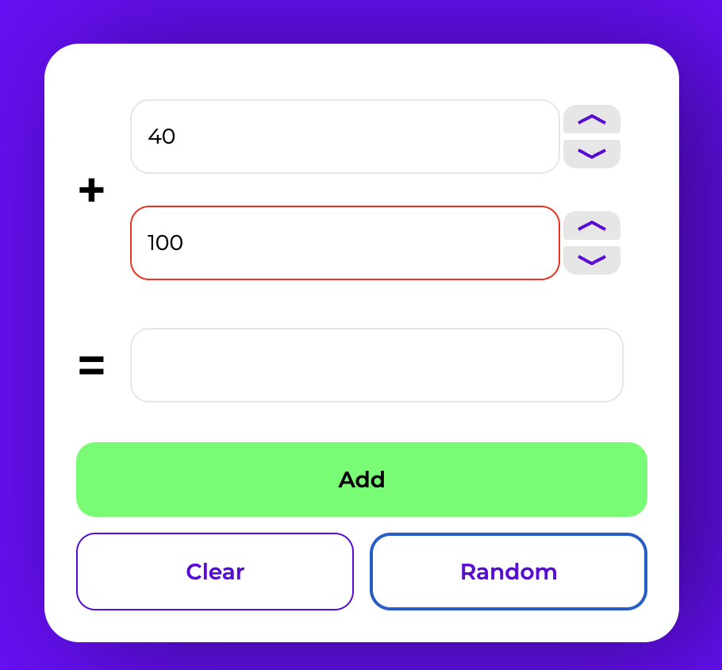
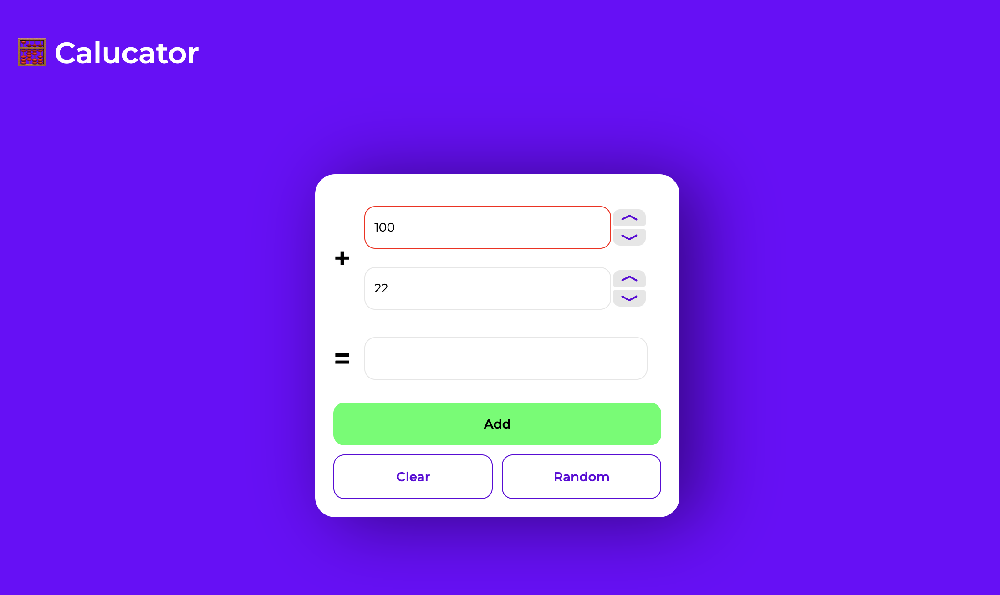
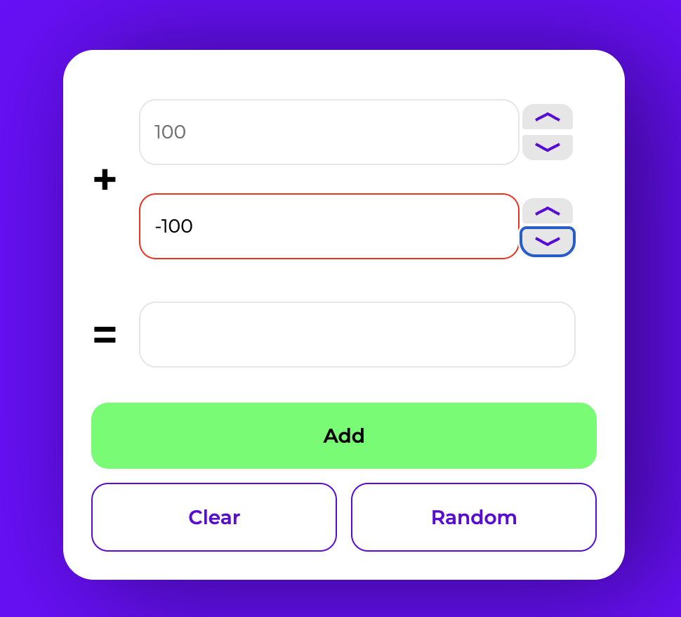
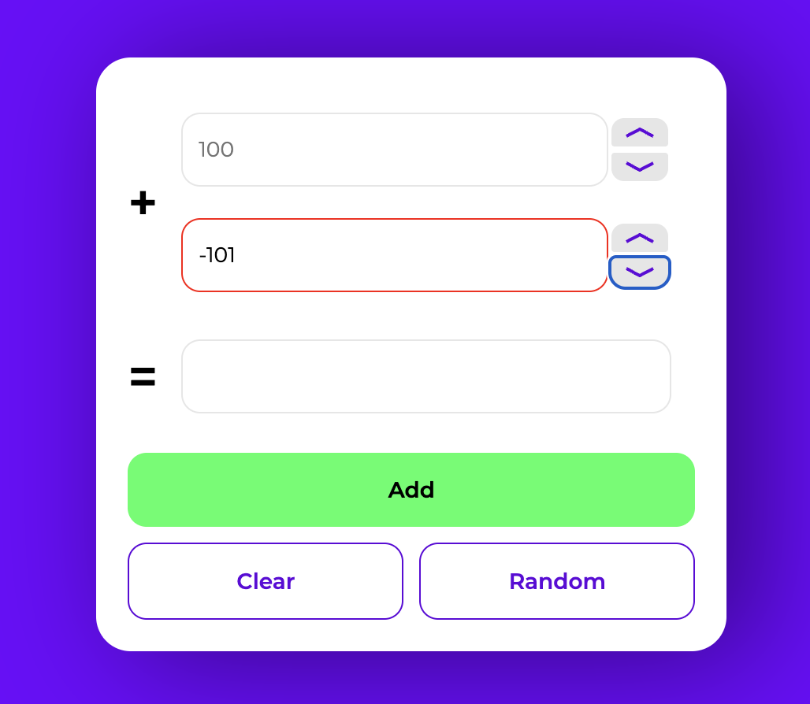

### Jira Issue: [QASPRINT-787] "Random" button generates out-of-range integers

**Project:** Hillel QA sprints  
**Reporter:** Viktoriia Masanovets  
**Assignee:** Oleksandr Holubyshko  
**Priority:** High  
**Status:** Backlog  
**Severity:** Major  
**Test Case ID:** 4  
**Version:** v1.0  
**Component:** Calculator  
**Created:** 30 Jul 2025  
**Updated:** 30 Jul 2025  
**Environment:** macOS Ventura 13.5, Chrome 137.0.7151.120, Web application, MacBook Air M1

**Steps to Reproduce:**
1. Open the application [Hillel Calculator](https://calculator.students.hillel.it/)  
2. Click the "Random" button multiple times

**Expected Result:**  
Each time the "Random" button is clicked, new valid integers within the accepted range (-99 to 99) should appear in the top and bottom input fields

**Actual Result:**  
Occasionally, invalid out-of-range integers appear in the input fields after multiple clicks

**Attachments:** 

<table>
<tr>
  <td></td>
  <td></td>
</tr>
<tr>
  <td>Screenshot 33</td>
  <td>Screenshot 40</td>
</tr>
</table>

### Jira Issue: [QASPRINT-788] Bottom field shows out-of-range integers when the "Rows Down" button is clicked

**Project:** Hillel QA sprints  
**Reporter:** Viktoriia Masanovets  
**Assignee:** Oleksandr Holubyshko  
**Priority:** Normal  
**Status:** Backlog  
**Severity:** Minor  
**Test Case ID:** 5  
**Version:** v1.0  
**Component:** Calculator  
**Created:** 30 Jul 2025  
**Updated:** 30 Jul 2025  
**Environment:** macOS Ventura 13.5, Chrome 137.0.7151.120, Web application, MacBook Air M1

**Steps to Reproduce:**
1. Open the application [Hillel Calculator](https://calculator.students.hillel.it/)  
2. Enter integer -99 in the bottom input field  
3. Click the "Rows Down" button twice

**Expected Result:**  
The value does not change and remains -99

**Actual Result:**  
The bottom field shows -100 after the first click and -101 after the second click

**Attachments:**  
<table>
<tr>
  <td></td>
  <td></td>
</tr>
<tr>
  <td>Screenshot 39</td>
  <td>Screenshot 52</td>
</tr>
</table>

